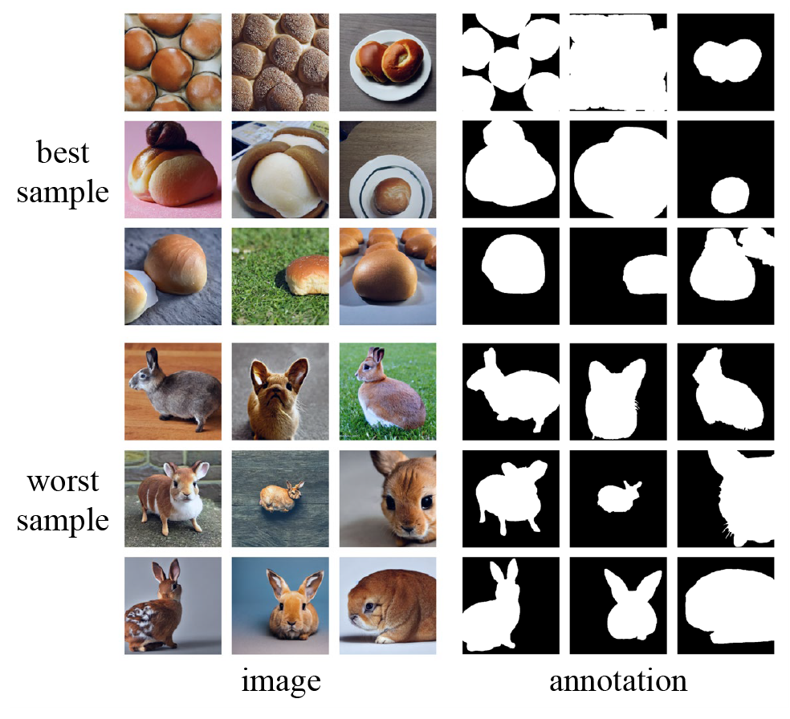

<div align="center">

<h1>Generative Active Learning for Long-tailed Instance Segmentation</h1>

[Muzhi Zhu](https://scholar.google.com/citations?user=064gBH4AAAAJ&hl=en)<sup>1*</sup>, &nbsp; 
[Chengxiang Fan](https://scholar.google.com/citations?user=I2aAMsAAAAAJ&hl=en)<sup>1*</sup>, &nbsp;
[Hao Chen](https://stan-haochen.github.io/)<sup>1†</sup>, &nbsp;
[Yang Liu](https://scholar.google.com/citations?user=9JcQ2hwAAAAJ&hl=en)<sup>1</sup>, &nbsp; 
[Weian Mao](https://scholar.google.com/citations?user=Qu-QXTsAAAAJ&hl=en)<sup>2 1</sup>, &nbsp;
Xiaogang Xu<sup>3 1</sup>, &nbsp;
[Chunhua Shen](https://cshen.github.io/)<sup>1†</sup> 

<sup>1</sup> [Zhejiang University](https://www.zju.edu.cn/english/), &nbsp;
<sup>2</sup> [The University of Adelaide](https://www.adelaide.edu.au/), &nbsp;
<sup>3</sup> [The Chinese University of Hong Kong](https://www.cuhk.edu.hk/english/)

<sup>*</sup> Equal contribution &nbsp;
<sup>†</sup> Corresponding author

[`Paper`](https://arxiv.org/abs/2406.02435) | [`BibTeX`](#CitingBSGAL) | [`LICENSE`](../LICENSE)
</div>

## 🚀 Overview
<div align="center">

</div>

## 📖 Description
Recently, large-scale language-image generative models have gained widespread attention and many works have utilized generated data from these models to further enhance the performance of perception tasks. However, not all generated data can positively impact downstream models, and these methods do not thoroughly explore how to better select and utilize generated data. On the other hand, there is still a lack of research oriented towards active learning on generated data. In this paper, we explore how to perform active learning specifically for generated data in the long-tailed instance segmentation task. Subsequently, we propose BSGAL, a new algorithm that online estimates the contribution of the generated data based on gradient cache. BSGAL can handle unlimited generated data and complex downstream segmentation tasks effectively. Experiments show that BSGAL outperforms the baseline approach and effectually improves the performance of long-tailed segmentation.

## 📣 News
- 2024.7 We have released the code of BSGAL!
- 2024.5 BSGAL has been accepted to ICML 2024!

## 🗓️ TODO
- [x] Release base codes
- [x] Release weights

## 🖼️ Demo
<div align="center">

</div>

<!-- ## 📊 Results -->
## 📦 Getting Started
Prepare the environment and dataset following [X-Paste](https://github.com/yoctta/xpaste).

### Training 
```bash
bash launch.sh --config configs/BSGAL/BSGAL_R50.yaml
```

### Evaluation
First download the weights from [Here](https://drive.google.com/drive/folders/1ezbXFvmist64wS2tDIvx1EGW_w6V4g-r?usp=drive_link)
```bash
bash launch.sh --config configs/BSGAL/BSGAL_R50.yaml --eval-only MODEL.WEIGHTS path/to/weights
```

## 🤝 Acknowledgement
We thank the following repos for their great works:
- [X-Paste](https://github.com/yoctta/xpaste)

## <a name="CitingBSGAL"></a> 🖊️ Citation
If you find this project useful in your research, please consider cite:

```BibTeX
@inproceedings{zhu2024generative,
      title={Generative Active Learning for Long-tailed Instance Segmentation}, 
      author={Muzhi Zhu and Chengxiang Fan and Hao Chen and Yang Liu and Weian Mao and Xiaogang Xu and Chunhua Shen},
      booktitle={International Conference on Machine Learning},
      year={2024},
}
```