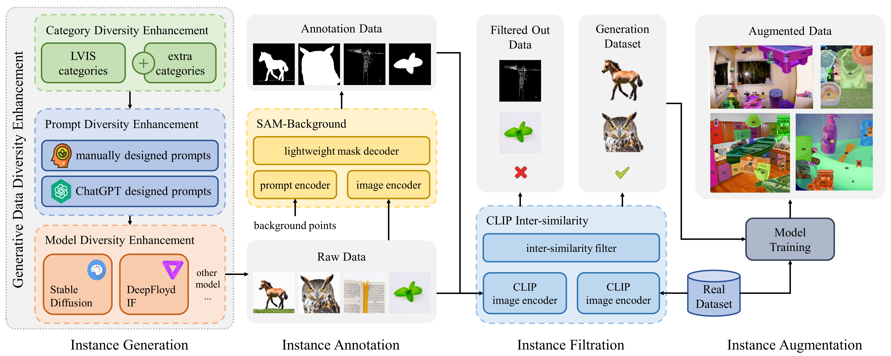

<div align="center">

<h1>DiverGen: Improving Instance Segmentation by Learning Wider Data Distribution with More Diverse Generative Data</h1>

[Chengxiang Fan](https://scholar.google.com/citations?user=I2aAMsAAAAAJ&hl=en)<sup>1*</sup>, &nbsp;
[Muzhi Zhu](https://scholar.google.com/citations?user=064gBH4AAAAJ&hl=en)<sup>1*</sup>, &nbsp; 
[Hao Chen](https://stan-haochen.github.io/)<sup>1†</sup>, &nbsp;
[Yang Liu](https://scholar.google.com/citations?user=9JcQ2hwAAAAJ&hl=en)<sup>1</sup>, &nbsp; 
[Weijia Wu](https://scholar.google.com/citations?user=NgjTRe4AAAAJ&hl=en)<sup>1</sup>, &nbsp;
Huaqi Zhang<sup>2</sup>, &nbsp;
[Chunhua Shen](https://cshen.github.io/)<sup>1†</sup>

<sup>1</sup> [Zhejiang University](https://www.zju.edu.cn/english/), &nbsp;
<sup>2</sup> [vivo Mobile Communication Co.](https://www.vivo.com/en/)

<sup>*</sup> Equal contribution &nbsp;
<sup>†</sup> Corresponding author

[`Paper`](https://arxiv.org/abs/2405.10185) | [`Slides`](https://cvpr.thecvf.com/media/cvpr-2024/Slides/30504.pdf) | [`BibTeX`](#CitingDiverGen)
</div>

## 🚀 Overview
<div align="center">

</div>

## 📖 Description
Instance segmentation is data-hungry, and as model capacity increases, data scale becomes crucial for improving the accuracy.
Most instance segmentation datasets today require costly manual annotation, limiting their data scale. Models trained on such data are prone to overfitting on the training set, especially for those rare categories. While recent works have delved into exploiting generative models to create synthetic datasets for data augmentation, these approaches do not efficiently harness the full potential of generative models. 

To address these issues, we introduce a more efficient strategy to construct generative datasets for data augmentation, termed **DiverGen**. Firstly, we provide an explanation of the role of generative data from the perspective of distribution discrepancy. We investigate the impact of different data on the distribution learned by the model. We argue that generative data can expand the data distribution that the model can learn,
thus mitigating overfitting. Additionally, we find that the diversity of generative data is crucial for improving model performance and enhance it through various strategies, including category diversity, prompt diversity, and generative model diversity. With these strategies, we can scale the data to millions while maintaining the trend of model performance improvement. On the LVIS dataset, DiverGen significantly outperforms the strong model X-Paste, achieving +**1.1** box AP and +**1.1** mask AP across all categories, and +**1.9** box AP and +**2.5** mask AP for rare categories.

## 📣 News
- 2024.11 We have released the code of DiverGen!
- 2024.2 DiverGen has been accepted to CVPR 2024!

## 🗓️ TODO
- [x] Release codes
- [x] Release weights

## 🖼️ Demo
<div align="center">

</div>

## 📊 Results
### Results of different scales of generative data on LVIS val set

 \# Gen Data | GDDE | $\text{AP}^{box}$ | $\text{AP}^{mask}$ | $\text{AP}_r^{box}$ | $\text{AP}_r^{mask}$ 
:----------:|:----:|:----------------:|:------------------:|:-------------------:|:--------------------:
 0          |      | 47.50            | 42.32              | 41.39               | 36.83                
 300k       |      | 49.65            | 44.01              | 45.68               | 41.11                
 600k       |      | 50.03            | 44.44              | 47.15               | 41.96                
 1200k      |      | 49.44            | 43.75              | 42.96               | 37.91                
 600k       | ✅    | 50.67            | 44.99              | 48.52               | 43.63                
 1200k      | ✅    | **51.24**        | **45.48**          | **50.07**           | **45.85**      


### Comparison with previous methods on LVIS val set
 Method              | Backbone        | $\text{AP}^{box}$ | $\text{AP}^{mask}$ | $\text{AP}_r^{box}$ | $\text{AP}_r^{mask}$ | Checkpoint
:-------------------:|:---------------:|:----------------:|:------------------:|:-------------------:|:--------------------: |:--------------------: 
 [CenterNet2](https://arxiv.org/abs/2103.07461)          | Swin-L          | 47.5             | 42.3               | 41.4                | 36.8                 | [Google Drive](https://drive.google.com/drive/folders/1vVwrZ4ad0xiWVO-JLaxRdLMDq4vdRZwT?usp=sharing)
 [X-Paste](https://arxiv.org/abs/2212.03863)             | Swin-L          | 50.1             | 44.4               | 48.2                | 43.3                 | [Google Drive](https://drive.google.com/drive/folders/1vVwrZ4ad0xiWVO-JLaxRdLMDq4vdRZwT?usp=sharing)
 **DiverGen (Ours)** | Swin-L          | **51.2**         | **45.5**           | **50.1**            | **45.8**    | [Google Drive](https://drive.google.com/file/d/1c8O0zvLCRk7CwjJNX9Pdw-Bu2QJ4gTDx/view?usp=sharing)


## 📓 Requirements

```
conda create -n divergen python=3.9
conda activate divergen
pip install -r requirements.txt
```

## 🔢 Data Acquisition
### LVIS Dataset
Download [LVIS](https://www.lvisdataset.org/dataset) dataset, place them under `DETECTRON2_DATASETS` following [Detectron2](https://github.com/facebookresearch/detectron2/tree/main/datasets).

### Data Generation
Please read [DATA.md](DATA.md) for data generation.

## 🔥 Training
Preliminary
1. edit `INST_POOL_PATH` in config file as your instance pool json
2. edit `DETECTRON2_DATASETS` in launch.sh as your dataset path

```
bash launch.sh --config-file configs/DiverGen_swinL.yaml
```

Truncate ImageNet parameters
```python
python -m torch.distributed.launch \
    --nproc_per_node 1 \
    --use_env \
    tools/convert_imgnet_model_to_lvis.py \
    --input_model_path IN_MODEL_PATH \
    --output_model_path OUT_MODEL_PATH \
    --input_num_category 1453 \
    --output_num_category 1203 \
    --dist \
    --backend gloo
```

## 👟 Evaluation
Preliminary
1. edit `DETECTRON2_DATASETS` in launch.sh as your dataset path
2. download [checkpoint](https://drive.google.com/file/d/1c8O0zvLCRk7CwjJNX9Pdw-Bu2QJ4gTDx/view?usp=sharing) and put it in `checkpoint/` folder
```
bash launch.sh --config-file configs/DiverGen_swinL.yaml --eval MODEL.WEIGHTS checkpoint/DiverGen_swinL.pth
```

## 🤝 Acknowledgement
We thank the following repos for their great works:
- [X-Paste](https://github.com/yoctta/xpaste)
- [DeepFloyd-IF](https://github.com/deep-floyd/IF)
- [SAM](https://github.com/facebookresearch/segment-anything)
- [CLIP](https://github.com/openai/CLIP)

## <a name="CitingDiverGen"></a> 🖊️ Citation
If you find this project useful in your research, please cite:

```BibTeX
@inproceedings{fan2024divergen,
  title={DiverGen: Improving Instance Segmentation by Learning Wider Data Distribution with More Diverse Generative Data},
  author={Fan, Chengxiang and Zhu, Muzhi and Chen, Hao and Liu, Yang and Wu, Weijia and Zhang, Huaqi and Shen, Chunhua},
  booktitle={Proceedings of the IEEE/CVF Conference on Computer Vision and Pattern Recognition},
  pages={3986--3995},
  year={2024}
}
```
